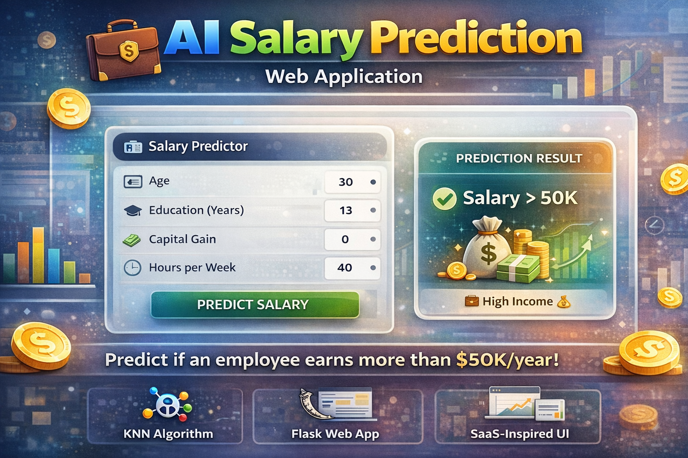

  

# 💼 AI Salary Prediction Web Application

An end-to-end Machine Learning web application that predicts whether an employee earns more than **50K** annually using the **K-Nearest Neighbors (KNN)** algorithm.

This project demonstrates a complete ML lifecycle — from data preprocessing and model training to deployment using a modern **Flask-based web interface** with a premium SaaS-style UI.

---

## 🚀 Key Features

* Predicts salary category (**>50K or ≤50K**) in real-time
* Built using **K-Nearest Neighbors (KNN)** algorithm
* Clean and modern **SaaS-inspired UI design**
* End-to-end ML pipeline implementation
* Scalable and deployment-ready architecture

---

## 🧠 Machine Learning Pipeline

* Data Loading and Exploration
* Data Preprocessing and Label Encoding
* Feature Scaling using **StandardScaler**
* Model Training with **KNN Algorithm**
* Hyperparameter Tuning (Optimal K Value)
* Model Evaluation (Confusion Matrix & Accuracy)
* Model Serialization using Pickle
* Deployment using Flask Web Framework

---

## 🛠️ Tech Stack

**Frontend:**

* HTML5
* CSS3 (Glassmorphism + SaaS UI Design)

**Backend:**

* Flask (Python)

**Machine Learning:**

* scikit-learn
* pandas
* numpy

**Visualization:**

* matplotlib

---

## 📂 Project Structure

SALARY_ESTIMATION_KNN/

├── app.py                # Flask application
├── model.py              # Model training script
├── salary.csv            # Dataset
├── knn_model.pkl         # Trained KNN model
├── scaler.pkl            # StandardScaler object
│
├── templates/
│   └── index.html        # Frontend UI
│
└── requirements.txt      # Dependencies

---

## ⚙️ Installation & Setup

### 1. Clone the Repository

git clone https://github.com/selvan-01/salary-prediction-knn.git
cd salary-prediction-knn

### 2. Install Dependencies

pip install -r requirements.txt

### 3. Train the Model

python model.py

### 4. Run the Flask Application

python app.py

### 5. Access the Application

Open your browser and navigate to:
http://127.0.0.1:5000/

---

## 📊 Model Details

* Algorithm: K-Nearest Neighbors (KNN)
* Distance Metric: Euclidean (Minkowski, p = 2)
* Feature Scaling: StandardScaler
* Output: Binary Classification

  * 0 → Salary ≤50K
  * 1 → Salary >50K

---

## 🎯 Example Prediction

**Input:**
Age: 30
Education: 13
Capital Gain: 0
Hours per Week: 40

**Output:**
Salary > 50K 💰

---

## 🚀 Future Enhancements

* Add prediction confidence score visualization
* Deploy on cloud platforms (Render / Railway)
* Implement REST API endpoints
* Upgrade to advanced models (Random Forest, XGBoost)
* Add authentication and user dashboard

---

## 🤝 Contribution

Contributions are welcome. Feel free to fork the repository and submit pull requests to enhance the project.

---
## 🔗 Links

- 💼 [LinkedIn](https://www.linkedin.com/in/senthamil45)
- 🌍 [Portfolio](https://senthamill.vercel.app/)
- 💻 [GitHub](https://github.com/selvan-01/salary-prediction-knn.git)

## 📬 Contact

Email: senthamils445@gmail.com
LinkedIn: https://www.linkedin.com/in/senthamil45

---

## ⭐ Support

If you found this project useful, consider giving it a ⭐ on GitHub.

---

**Built with ❤️ using Machine Learning and Flask**
